<picture>
  <source media="(max-width: 600px)" srcset="./assets/terminal-mobile.svg" />
  
</picture>

<p align="center">
  <a href="https://github.com/luca-1802?tab=repositories"><code>explore repositories ↗</code></a>
  &nbsp;·&nbsp;
  <a href="https://github.com/luca-1802?tab=stars"><code>starred finds ↗</code></a>
</p>

### `01` &nbsp; `~/about`

I build tools for the web and the terminal — from a self-hosted password manager to small Python utilities that make everyday tasks easier.

```typescript
const luca = {
  code: ["Python", "TypeScript"],
  tools: ["React", "Docker", "Git"],
  focus: "automation & CLI tools",
};
```

### `02` &nbsp; `~/projects`

**[password-manager ↗](https://github.com/luca-1802/password-manager)**<br />
A self-hosted vault with a web dashboard, browser extension, and CLI.<br />
<sub><code>TypeScript</code> <code>React</code> <code>Python</code></sub>

**[file-organizer ↗](https://github.com/luca-1802/file-organizer)**<br />
Sort files into folders using configurable extension rules.<br />
<sub><code>Python</code></sub>

**[weather-cli ↗](https://github.com/luca-1802/weather-cli)**<br />
Current weather for any city, straight from the terminal.<br />
<sub><code>Python</code> <code>OpenWeather</code></sub>

### `03` &nbsp; `~/activity`

<details>
  <summary><code>$ github --stats</code> &nbsp; contributions, languages &amp; streaks</summary>
  <br />
  <p>
    
    
  </p>
  <p>
    
  </p>
</details>

---

<p align="center"><samp>read the source. make it yours. ship the next thing.</samp></p>
