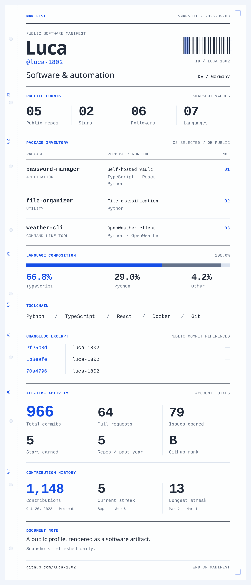

<picture>
  <source media="(prefers-color-scheme: dark) and (max-width: 600px)" srcset="./assets/manifest-dark-mobile.svg" />
  <source media="(max-width: 600px)" srcset="./assets/manifest-light-mobile.svg" />
  <source media="(prefers-color-scheme: dark)" srcset="./assets/manifest-dark.svg" />
  
</picture>

  <samp>
    <a href="https://github.com/luca-1802/password-manager">password-manager</a> ·
    <a href="https://github.com/luca-1802/file-organizer">file-organizer</a> ·
    <a href="https://github.com/luca-1802/weather-cli">weather-cli</a>
  </samp>
   
  <samp><a href="https://github.com/luca-1802?tab=repositories">all repositories</a> / <a href="./assets/profile.txt">text view</a></samp>

