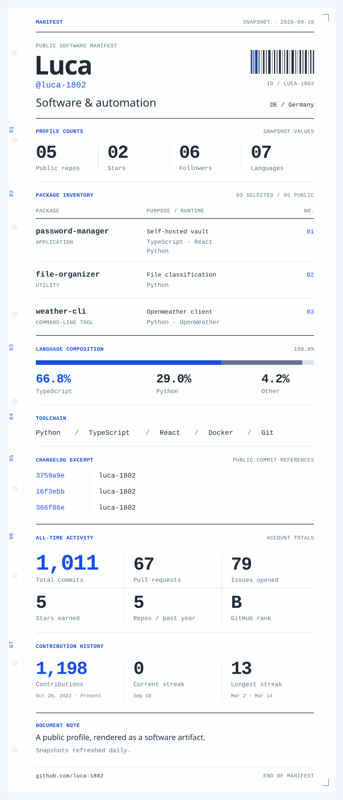

<picture>
  <source media="(prefers-color-scheme: dark) and (max-width: 600px)" srcset="./assets/manifest-dark-mobile-v2.svg" />
  <source media="(max-width: 600px)" srcset="./assets/manifest-light-mobile-v2.svg" />
  <source media="(prefers-color-scheme: dark)" srcset="./assets/manifest-dark-v2.svg" />
  
</picture>
