<div align="center">
  
</div>

<picture>
  <source media="(max-width: 600px)" srcset="./assets/hero-mobile.svg" />
  
</picture>

## `./whoami`

```text
> Luca / Germany
> software · automation · self-hosting
> Python · TypeScript · React · Docker
```

## `./stats`

<picture>
  <source media="(max-width: 600px)" srcset="./assets/stats-mobile.svg" />
  
</picture>

## `./now`

<picture>
  <source media="(max-width: 600px)" srcset="./assets/ticker-mobile.svg" />
  
</picture>

## `./boot`

<picture>
  <source media="(max-width: 600px)" srcset="./assets/boot-mobile.svg" />
  
</picture>

## `./dump`

<picture>
  <source media="(max-width: 600px)" srcset="./assets/hexdump-mobile.svg" />
  
</picture>

## `./top`

<picture>
  <source media="(max-width: 600px)" srcset="./assets/repos-mobile.svg" />
  
</picture>

[<samp>password-manager</samp>](https://github.com/luca-1802/password-manager) · [<samp>file-organizer</samp>](https://github.com/luca-1802/file-organizer) · [<samp>weather-cli</samp>](https://github.com/luca-1802/weather-cli)

## `./lang`

<picture>
  <source media="(max-width: 600px)" srcset="./assets/languages-mobile.svg" />
  
</picture>

## `./tail`

<picture>
  <source media="(max-width: 600px)" srcset="./assets/events-mobile.svg" />
  
</picture>

<div align="center">
  <samp><a href="https://github.com/luca-1802?tab=repositories">repositories</a> / <a href="./assets/profile.txt">text view</a></samp>
  <br /><br />
  <sub><samp>session remains open _</samp></sub>
</div>
